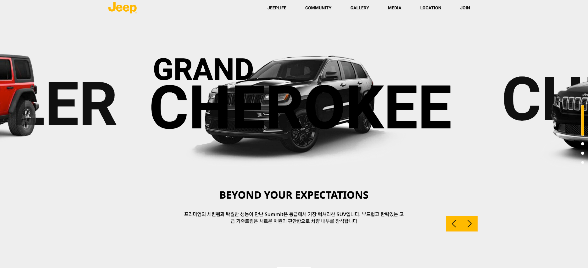

# JEEP 리뉴얼 페이지

   
  
   

## 프로젝트 소개

리액트 프로젝트의 상태관리 redux-saga에서 redex-toolkit을 사용하였습니다.

 

## 기술 스택

       

 

## 구현 기능

- react
- ❗️redex-toolkit
- 스와이퍼 슬라이드
- 바닐라 스크립트 슬라이드
- fetch이용한 json 데이터 호출
- flickr, youtube 재생목록, api 호출
- 자바스크립트 스크롤 모션

 

## 배운 점 & 아쉬운 점

배운점  
redux-saga에서 redux-toolkit으로 바꾸면서 saga에서는 
actionType, reducer, api, saga에서 작업하던 기능들을 slice파일 하나에 통합하여 전역으로 관리했습니다.
